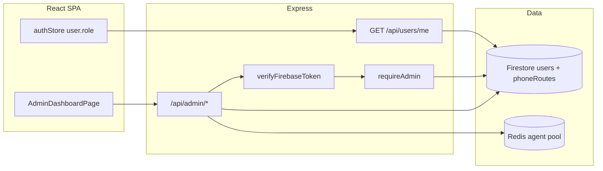

# Admin panel — implementation plan

## Goal

- **Dashboard** for operators: active agents, pool state (available / ringing / busy), agents **by campaign**, and **DIDs mapped to campaigns** (editable in app, stored in Firestore).
- **Access**: Everyone signs up as usual; you promote users in **Firebase Console** by setting Firestore `users/{uid}.role` to `"admin"`. No separate admin signup.
- **Truth**: Firebase Auth for identity; **Firestore** for `role` and DID config; **Redis** for live agent state (already implemented).

## Architecture (high level)

## Phase 1 — Roles and API gate (do first)

### 1.1 Firestore schema

| Location      | Field  | Values                           |
| ------------- | ------ | -------------------------------- |
| `users/{uid}` | `role` | `"agent"` (default) or `"admin"` |

- **Promote admin**: Console → Firestore → `users` → document → `role`: `"admin"`.
- **Default on signup**: When creating/updating the user document from signup (`[authStore.signup](frontend/src/store/authStore.js)` → `[saveProfile](frontend/src/services/profileService.js)` → `[patchMe` / `mergeUserDoc](backend/src/controllers/userController.js)`), set `role: 'agent'` only if the document has no `role` yet (do **not** overwrite an existing `"admin"` if the same user PATCHes their profile).

### 1.2 Backend middleware

- New file: `[backend/src/middleware/requireAdmin.js](backend/src/middleware/requireAdmin.js)`
  - Preconditions: `req.user.uid` set by `verifyFirebaseToken`.
  - Load `getUserDoc(uid)` from `[userDataService](backend/src/services/userDataService.js)`.
  - If `data?.role !== 'admin'` → `403 { error: 'Forbidden' }`.

### 1.3 Ensure `GET /api/users/me` returns `role`

- `[getMe](backend/src/controllers/userController.js)` already returns the full Firestore doc; once `role` exists on documents, it will serialize. Optionally document in README that clients should treat missing `role` as `"agent"`.

### 1.4 Admin routes skeleton

- New: `[backend/src/routes/adminRoutes.js](backend/src/routes/adminRoutes.js)` — `router.use` chain: `verifyFirebaseToken`, `requireAdmin`, then routes.
- New: `[backend/src/controllers/adminController.js](backend/src/controllers/adminController.js)` — thin handlers calling services.
- `[backend/src/server.js](backend/src/server.js)`: `app.use('/api/admin', adminRoutes)` (admin router applies its own middleware stack **or** mount `verifyFirebaseToken` + `requireAdmin` once on `app.use('/api/admin', ...)` — avoid double `verify`).

**Endpoints (MVP)**

| Method | Path                   | Purpose                                                                                                          |
| ------ | ---------------------- | ---------------------------------------------------------------------------------------------------------------- |
| GET    | `/api/admin/overview`  | Pool snapshot + counts by `campaignId` + campaign labels from `[CAMPAIGN_CONFIG](backend/src/config/pricing.js)` |
| GET    | `/api/admin/agents`    | List each live agent (id, campaignId, status, licensedStates[])                                                  |
| GET    | `/api/admin/campaigns` | Read-only list of campaign ids + labels (from `CAMPAIGN_CONFIG`)                                                 |
| GET    | `/api/admin/dids`      | List Firestore DID rows                                                                                          |
| POST   | `/api/admin/dids`      | Create row                                                                                                       |
| PATCH  | `/api/admin/dids/:id`  | Update row                                                                                                       |
| DELETE | `/api/admin/dids/:id`  | Delete row                                                                                                       |

Optional later: `GET /api/admin/calls?limit=` wired to `[callLogService](backend/src/services/callLogService.js)` if you want volume on the same screen.

## Phase 2 — Redis introspection

- Extend `[agentManager](backend/src/services/agentManager.js)` with something like:
  - `getOverview()` — calls existing `getPoolSnapshot()`, then for each id in the union of sets, `hGetAll('agent:{id}')`, parse `licensedStates`, aggregate **count per `campaignId`**.
- Keep this **read-only** (no mutating Redis from admin UI in v1 unless you explicitly want “force remove agent” later).

## Phase 3 — Firestore DID collection

- Collection name (suggested): `**phoneRoutes`** (or `campaignDids`).
- Document fields (example):
  - `phoneE164` (string, e.g. `+15551234567`) — unique
  - `campaignId` (string, must match a key in `CAMPAIGN_CONFIG` or validate server-side)
  - `label` (optional string)
  - `active` (boolean)
  - `updatedAt` / `createdAt` (server timestamps)
- Helpers in `[userDataService.js](backend/src/services/userDataService.js)` or a small `[phoneRouteService.js](backend/src/services/phoneRouteService.js)`: list, create, update, delete (admin-only callers).
- **v1 behavior**: Admin UI is the source of truth for **your records**; Twilio still needs voice URLs / `campaign` query params aligned (manual or existing). **v2**: In `[voiceController` incoming handler](backend/src/controllers/voiceController.js), look up `req.body.To` in `phoneRoutes` to set `campaign` when not in query/body.

## Phase 4 — Frontend

### 4.1 Load `role` into auth state

- `[authStore](frontend/src/store/authStore.js)`: After `onAuthStateChanged` and token, call `getProfile(uid)` (existing `[profileService.getProfile](frontend/src/services/profileService.js)`) and merge `role` into `user` (default `'agent'` if absent).
- On login/signup success paths, same merge so redirects work immediately.

### 4.2 Routing

- `[App.jsx](frontend/src/App.jsx)`: nested route under `/app`, e.g. `path="admin"` with a wrapper that:
  - If `!token` → existing protected behavior
  - If `user.role !== 'admin'` → `<Navigate to="/app" replace />` or a small “Not authorized” view

### 4.3 Sidebar

- `[Sidebar.jsx](frontend/src/components/layout/Sidebar.jsx)`: inject nav item `{ path: '/app/admin', label: 'Admin', icon: Shield }` (or `LayoutGrid`) **only** when `user?.role === 'admin'`.

### 4.4 Admin UI

- New: `[frontend/src/pages/AdminDashboardPage.jsx](frontend/src/pages/AdminDashboardPage.jsx)` + `[AdminDashboardPage.module.css](frontend/src/pages/AdminDashboardPage.module.css)`
- New: `[frontend/src/services/adminService.js](frontend/src/services/adminService.js)` — `apiFetch` wrappers for `/api/admin/`*
- Layout: match existing app shell (same as other pages under `AppShell`).
- Sections:
  1. **Summary cards**: total live agents; available / ringing / busy counts; optional “campaigns with coverage” list
  2. **Agents table**: from `GET /api/admin/agents`
  3. **DIDs table**: from `GET /api/admin/dids` with edit modal or inline for campaign + active

## Security checklist

- No admin JSON endpoints without `verifyFirebaseToken` + `requireAdmin`.
- `patchMe` must not allow a user to set their own `role` to `admin` via request body (strip `role` from non-admin PATCH or ignore `role` unless internal admin tool — **recommended**: never accept `role` from `patchMe` for self-service).
- Firestore rules (if used client-side): keep using **backend only** for admin; do not expose admin writes from the client SDK.

## Testing

- User with `role: agent` → `/api/admin/overview` → 403; `/app/admin` redirects.
- User with `role: admin` → 200, dashboard renders; DID CRUD persists in Firestore.
- After promoting to admin in Console, user must **refresh token / reload app** (or re-fetch profile) so `getMe` returns `role: admin`.

## File summary (expected new/changed)

| Area     | Files                                                                                                                                                                                                                          |
| -------- | ------------------------------------------------------------------------------------------------------------------------------------------------------------------------------------------------------------------------------ |
| Backend  | `middleware/requireAdmin.js`, `routes/adminRoutes.js`, `controllers/adminController.js`, `server.js`, optional `services/phoneRouteService.js`, `agentManager.js` (helpers), `userController.js` (strip `role` from `patchMe`) |
| Frontend | `authStore.js`, `App.jsx`, `Sidebar.jsx`, `AdminDashboardPage.jsx`, `AdminDashboardPage.module.css`, `adminService.js`                                                                                                         |

