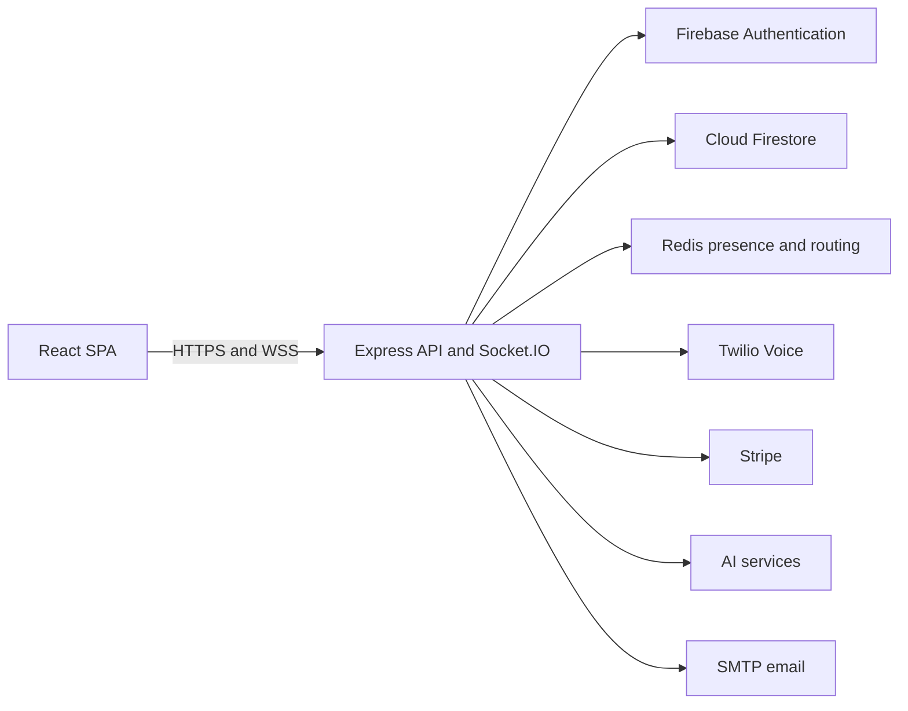

# CallsFlow

CallsFlow is a browser-based calling and operations platform for distributed agent teams. It combines real-time call routing, WebRTC calling, agent presence, billing, quality assurance, analytics, team management, and administrative controls in one application.

This repository contains the React frontend and Node.js API used by the platform.

## What the platform includes

- Browser calling powered by the Twilio Voice SDK
- Real-time agent availability and call-state updates
- Campaign and licensed-state routing
- Call history, recordings, notes, and scripts
- Wallet, checkout, subscription, and transaction workflows
- AI-assisted coaching and quality-assurance workflows
- Referral, support, and notification systems
- Admin analytics, live operations, phone routing, and campaign controls
- Manager, agency, QA, agent, and platform-admin access levels

## Architecture



The frontend is a Vite-powered single-page application. Authentication is handled by Firebase, while authenticated API requests carry Firebase ID tokens. The API serves REST endpoints and Socket.IO from the same Node.js process. Redis coordinates agent presence and multi-instance socket delivery, and Firestore stores persistent application data.

For a deeper implementation overview, see [`architecture/architecture.md`](architecture/architecture.md).

## Technology

### Frontend

- React 18 and Vite
- React Router
- Zustand
- TanStack Query
- Firebase Web SDK
- Socket.IO Client
- Twilio Voice SDK
- Framer Motion
- Sentry

### Backend

- Node.js 22
- Express 5
- Socket.IO with Redis adapter
- Firebase Admin SDK and Firestore
- Twilio
- Stripe
- Nodemailer
- Sentry

## Repository layout

```text
.
├── architecture/        # Technical architecture documentation
├── backend/
│   ├── deploy/          # Deployment examples and operations documentation
│   ├── scripts/         # Release, deployment, maintenance, and seed scripts
│   ├── src/
│   │   ├── config/      # Service and runtime configuration
│   │   ├── controllers/ # HTTP request handlers
│   │   ├── middleware/  # Authentication, authorization, and security
│   │   ├── routes/      # API route definitions
│   │   ├── services/    # Business and integration logic
│   │   └── sockets/     # Real-time agent and call events
│   ├── tests/           # Backend tests
│   └── tools/           # One-off operational utilities
├── frontend/
│   ├── public/          # Static assets
│   └── src/
│       ├── components/  # Shared UI and role-specific components
│       ├── config/      # Client configuration
│       ├── pages/       # Application pages
│       ├── services/    # API and integration clients
│       ├── store/       # Zustand stores
│       └── styles/      # Shared design tokens and styles
└── .github/             # Release verification workflows
```

## Prerequisites

- Node.js 22
- npm
- A Firebase project with Authentication and Firestore enabled
- A Redis-compatible database for shared or production environments
- Twilio credentials and voice configuration
- Stripe credentials and webhook configuration
- SMTP credentials

Optional integrations include Sentry and an AI provider.

## Local development

### 1. Install dependencies

```bash
cd backend
npm install

cd ../frontend
npm install
```

### 2. Configure the backend

Create `backend/.env`. Obtain real values through the team's approved secret-management process. Never commit this file.

Core variable names:

```dotenv
NODE_ENV=development
PORT=3001
CLIENT_URL=http://localhost:5173
CLIENT_URLS=http://localhost:5173

FIREBASE_PROJECT_ID=
FIREBASE_CLIENT_EMAIL=
FIREBASE_PRIVATE_KEY=
FIREBASE_STORAGE_BUCKET=
FIRESTORE_DATABASE_ID=

FIREBASE_API_KEY=
FIREBASE_AUTH_DOMAIN=
FIREBASE_MESSAGING_SENDER_ID=
FIREBASE_APP_ID=

REDIS_URL=
REDIS_KEY_PREFIX=

TWILIO_ACCOUNT_SID=
TWILIO_AUTH_TOKEN=
TWILIO_API_KEY_SID=
TWILIO_API_KEY_SECRET=
TWILIO_TWIML_APP_SID=
TWILIO_PHONE_NUMBER=

STRIPE_SECRET_KEY=
STRIPE_WEBHOOK_SECRET=

SMTP_HOST=
SMTP_PORT=
SMTP_SECURE=
SMTP_USER=
SMTP_PASS=
```

The backend also supports service-account JSON/base64 alternatives, monitoring variables, AI-provider variables, and integration-specific settings. Keep all private keys, access tokens, signing secrets, and service-account files outside version control.

### 3. Configure the frontend

Copy the safe client template:

```bash
cd frontend
cp env.example .env.local
```

For local development, the frontend expects the API at `http://localhost:3001` unless `VITE_API_URL` is changed.

Only variables prefixed with `VITE_` are included in the browser build. Do not place server secrets in frontend environment files.

### 4. Start the applications

Run each service in a separate terminal:

```bash
# Terminal 1
cd backend
npm run dev
```

```bash
# Terminal 2
cd frontend
npm run dev
```

The frontend is normally available at `http://localhost:5173`, and the API at `http://localhost:3001`.

Verify the API:

```bash
curl http://localhost:3001/health
```

## Common commands

### Backend

```bash
npm run dev       # Start with automatic restart
npm start         # Start in standard mode
npm test          # Run backend tests
```

Seed and maintenance scripts modify data. Review their source and target environment before running them.

### Frontend

```bash
npm run dev       # Start the Vite development server
npm run build     # Create a production build
npm run preview   # Preview the production build
npm run lint      # Run ESLint
```

## Security

- Never commit `.env` files, production exports, service-account JSON, private keys, access tokens, or customer data.
- Do not copy production data into local development environments.
- Keep webhook-signature validation enabled in deployed environments.
- Restrict CORS to approved application origins.
- Use separate Redis key prefixes or databases for isolated environments.
- Run dependency audits before deployment:

```bash
cd backend && npm audit --omit=dev
cd ../frontend && npm audit --omit=dev
```

- Report suspected credential exposure immediately and rotate the affected secret.

## Testing and validation

Before opening a pull request:

```bash
cd backend
npm test
npm audit --omit=dev

cd ../frontend
npm run lint
npm run build
npm audit --omit=dev
```

Changes affecting calling, payments, authentication, routing, or webhooks should also be validated in a non-production environment with the appropriate provider test credentials.

## Deployment

The frontend and backend deploy independently:

- The frontend is built as a static Vite application by the configured hosting platform.
- The backend runs as a managed Node.js process behind a TLS reverse proxy.
- Production installs should use the committed lockfiles.
- Backend releases should use a rolling process reload and verify both the health and release endpoints.
- Environment-specific credentials must be configured on the deployment platform, never stored in the repository.

Refer to the internal operations runbook for authorized deployment procedures. Do not publish infrastructure addresses, account identifiers, tokens, or provider secrets in public documentation.

## Contributing

1. Branch from the intended base branch.
2. Keep changes focused and avoid committing generated data or secrets.
3. Run the relevant tests, lint checks, builds, and dependency audits.
4. Open a pull request describing the behavior change and verification performed.
5. Deploy only after review and environment-specific approval.

## License

This project is proprietary. Unauthorized use, distribution, or disclosure is prohibited.
