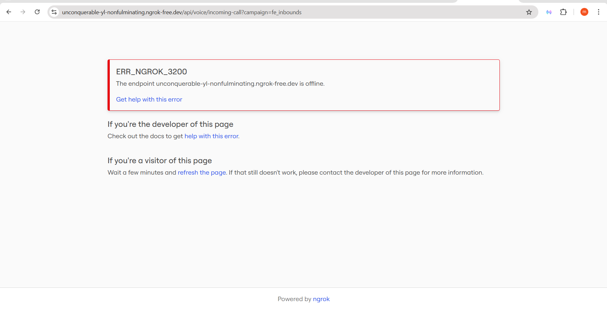

# System Architecture — CallsFlow Insurance Platform

## High-Level Overview

```
┌─────────────────────────────────────────────────────────────────────┐
│                          CLIENT LAYER                               │
│   React 18 + Vite (Browser SPA)                                     │
│   ├── Pages / Components                                            │
│   ├── Zustand (Local State)                                         │
│   ├── TanStack Query (Server State + Caching)                       │
│   └── Twilio Voice JS SDK (WebRTC Browser Calling)                  │
└────────────────────────┬────────────────────────────────────────────┘
                         │  HTTPS / WSS
┌────────────────────────▼────────────────────────────────────────────┐
│                         API GATEWAY                                  │
│   Nginx (Reverse Proxy + SSL Termination + Rate Limiting)           │
└──────┬─────────────────────────────────────────────┬────────────────┘
       │ REST                                         │ WebSocket
┌──────▼───────────────────┐              ┌──────────▼──────────────┐
│    REST API SERVER        │              │   WEBSOCKET SERVER       │
│    Node.js + Express      │              │   Node.js + Socket.io   │
│    ├── Auth Router        │              │   ├── Call Events       │
│    ├── Users Router       │◄─────────── │   ├── Go Live / Offline │
│    ├── Calls Router       │   Shared     │   ├── Real-time Stats   │
│    ├── Billing Router     │   DB Pool    │   └── Notifications     │
│    ├── Campaigns Router   │              └─────────────────────────┘
│    ├── Leads Router       │
│    └── Webhook Router     │   ◄──────── Twilio / Stripe Webhooks
└──────────────────────────┘
         │          │            │
    ┌────▼───┐  ┌───▼───┐  ┌────▼────┐
    │Postgres│  │ Redis │  │  AWS S3 │
    │  (DB)  │  │(Cache)│  │(Storage)│
    └────────┘  └───────┘  └─────────┘
         │
┌────────▼─────────────────────────────┐
│         EXTERNAL SERVICES            │
│  ├── Twilio Voice (Inbound Calls)    │
│  ├── Stripe (Billing / Subscriptions)│
│  └── SendGrid (Email Notifications)  │
└──────────────────────────────────────┘
```

---

## Layer-by-Layer Breakdown

### 1. Frontend (React + Vite)
- **SPA** served from a CDN (Netlify / Vercel / AWS CloudFront)
- Communicates with backend via **REST API** for data operations
- Connects to **WebSocket** for real-time call state and notifications
- Uses **Twilio Voice JS SDK** directly in the browser for WebRTC audio calling
- Zero page reloads — React Router handles all navigation client-side

---

### 2. API Gateway (Nginx)
- **SSL termination** — handles HTTPS, forwards HTTP internally
- **Rate limiting** — protects endpoints from abuse
- **Reverse proxy** — routes `/api/*` → REST server, `/ws` → WebSocket server
- Serves static frontend build for non-API routes

---

### 3. REST API Server (Node.js + Express)
**Responsibilities:**
- Authentication (JWT access token + refresh token via httpOnly cookie)
- Business logic for all CRUD operations
- Webhook endpoint for Twilio call events and Stripe payment events

**API Domains:**

| Domain | Endpoints |
|---|---|
| Auth | `POST /auth/login`, `POST /auth/register`, `POST /auth/refresh`, `POST /auth/logout` |
| Users | `GET /users/me`, `PATCH /users/me`, `POST /users/avatar` |
| Calls | `GET /calls`, `PATCH /calls/:id/disposition`, `POST /calls/:id/dispute` |
| Campaigns | `GET /campaigns`, `GET /campaigns/active` |
| Licensed States | `GET /users/me/states`, `PUT /users/me/states` |
| Twilio | `POST /twilio/token` (generate capability token), `POST /twilio/webhook` |
| Billing | `GET /billing/balance`, `GET /billing/transactions`, `POST /billing/add-credits` |
| Subscriptions | `GET /subscriptions/plans`, `POST /subscriptions/subscribe`, `DELETE /subscriptions/cancel` |
| Leads | `GET /leads`, `PATCH /leads/:id` |
| Script | `GET /script` |
| Referral | `GET /referral`, `POST /referral/invite` |

---

### 4. WebSocket Server (Socket.io)
**Real-time events:**

```
Client → Server:
  agent:go_live        { campaignId, accessToken }
  agent:go_offline     {}
  agent:heartbeat      {}

Server → Client:
  call:incoming        { callSid, callerNumber, campaignId }
  call:ended           { callSid, duration, disposition }
  call:missed          { callSid }
  agent:status_update  { status: "online" | "offline" | "on_call" }
  balance:update       { balance: 24.50 }
  notification:new     { message, type }
```

---

### 5. Database (PostgreSQL)

```sql
-- Core Tables

users
  id, email, password_hash, name, avatar_url, bio,
  landing_page_slug, status, credits_balance,
  subscription_plan_id, created_at

campaigns
  id, name, description, category (life|health),
  price_per_call, buffer_seconds, icon, is_active

call_logs
  id, agent_id, campaign_id, caller_number, call_sid,
  started_at, ended_at, duration_seconds,
  disposition (completed|missed|not_interested),
  is_billable, amount_charged

transactions
  id, user_id, type (credit_added|call_deducted),
  amount, description, created_at

licensed_states
  id, user_id, state_code (2-char), created_at

disputes
  id, call_log_id, agent_id, reason, status
  (pending|approved|rejected), created_at

subscriptions
  id, name, price_per_week, credits_per_week,
  price_per_call, savings_per_call

user_subscriptions
  id, user_id, plan_id, started_at, next_renew_at,
  is_active, stripe_subscription_id

leads
  id, agent_id, name, phone, email, state,
  campaign_id, status, notes, created_at

scripts
  id, campaign_id, content_json, updated_at
```

---

### 6. Redis (Cache + Sessions)

| Use Case | Key Pattern | TTL |
|---|---|---|
| Twilio capability tokens | `twilio_token:{userId}` | 3600s |
| Agent online status | `agent_status:{userId}` | 30s (heartbeat reset) |
| Rate limit counters | `ratelimit:{ip}:{endpoint}` | 60s |
| Dashboard stat cache | `stats:{userId}:{period}` | 300s |

---

### 7. Twilio Integration (Call Routing)

```
Inbound Caller
     │
     ▼
Twilio Phone Number
     │
     ▼ (HTTP webhook)
Backend /twilio/webhook
     │
     ├── Find available online agent for requested campaign
     ├── Create TwiML: <Dial><Client>{agentClientId}</Client></Dial>
     └── Ring agent browser via Twilio Voice JS SDK
```

**Key Flows:**
- Agent clicks "Go Live" → backend generates **Twilio Capability Token** → frontend registers as a Twilio client
- Inbound call arrives → Twilio POSTs webhook → backend builds TwiML → routes to agent's browser
- Call ends → Twilio POSTs status callback → backend logs call, deducts credits

---

### 8. Stripe Integration (Billing)

| Feature | Implementation |
|---|---|
| Add Credits | Stripe Payment Intent (one-time charge) |
| Silver/Gold Plan | Stripe Subscription (weekly billing) |
| Webhooks | `payment_intent.succeeded`, `invoice.paid`, `customer.subscription.deleted` |

---

### 9. File Storage (AWS S3)

- **Agent avatars** → `s3://bucket/avatars/{userId}.webp`
- **Call recordings** (future) → `s3://bucket/recordings/{callSid}.mp3`
- Accessed via **pre-signed URLs** — never exposed directly

---

## Security Model

| Layer | Mechanism |
|---|---|
| Authentication | JWT (15min access token) + httpOnly refresh cookie (7d) |
| Authorization | Role-based: `agent` / `admin` middleware |
| API Protection | Helmet.js, CORS whitelist, rate limiting |
| Webhooks | Twilio signature validation, Stripe webhook secret |
| Data | Passwords → bcrypt (12 rounds), env vars via dotenv |
| Transport | HTTPS/TLS everywhere, WSS for WebSocket |

---

## Deployment Topology

```
Internet
   │
   ▼
AWS Route 53 (DNS)
   │
   ├──► CloudFront CDN ──► S3 Static (React Build)
   │
   └──► EC2 / ECS Cluster
            │
            ├── Nginx Container (Port 80/443)
            │       │
            │       ├──► Express API Container (Port 3001)
            │       └──► Socket.io Container (Port 3002)
            │
            ├── RDS PostgreSQL (Managed)
            ├── ElastiCache Redis (Managed)
            └── S3 Bucket (Media Storage)
```

**For Development (Local):**
```
Frontend    → http://localhost:5173  (Vite dev server)
REST API    → http://localhost:3001  (Express)
WebSocket   → http://localhost:3002  (Socket.io)
PostgreSQL  → localhost:5432
Redis       → localhost:6379
```

---

## Monorepo Folder Structure

```
amplify-project/
├── frontend/               ← React + Vite SPA
│   ├── src/
│   │   ├── components/
│   │   ├── pages/
│   │   ├── store/
│   │   ├── services/       ← Axios API clients
│   │   ├── hooks/          ← Custom React hooks
│   │   └── styles/
│   └── package.json
│
├── backend/                ← Node.js + Express
│   ├── src/
│   │   ├── routes/
│   │   ├── controllers/
│   │   ├── services/       ← Business logic
│   │   ├── models/         ← Sequelize / Prisma models
│   │   ├── middleware/
│   │   ├── sockets/        ← Socket.io handlers
│   │   └── lib/            ← Twilio, Stripe, Redis clients
│   ├── prisma/
│   │   └── schema.prisma
│   └── package.json
│
├── pictures/               ← Reference screenshots
├── .env.example
└── README.md
```

---

## Data Flow Summary

```
[Agent Opens Browser]
       ↓
[React App Loads] → GET /users/me → Populate UI
       ↓
[Clicks "Go Live"] → POST /twilio/token → Register Twilio Client
       ↓               Socket: agent:go_live
[Inbound Call Arrives] → Twilio Webhook → Find Agent → TwiML Route
       ↓
[Browser Rings] → Twilio Voice JS SDK → Agent Picks Up
       ↓
[Call Active] → Real-time duration timer via WebSocket
       ↓
[Call Ends] → Twilio status callback → Log call → Deduct credits
       ↓
[Dashboard Updates] → WebSocket balance:update + stats:update
```
